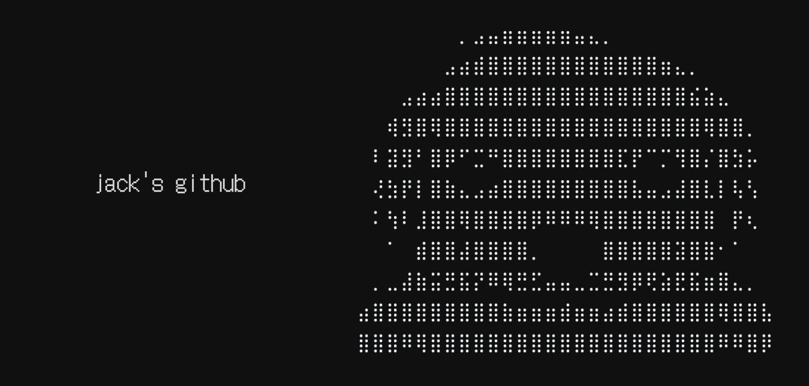

## <h2 align="center">  About  me </h2>

  Digital artist focused on frontend web development and ux/ui. 

  While I thrive on the frontend, I have experience building complete full-stack applications.
  My background as a digital artist gives me a distinct advantage in **visual hierarchy and asset creation**. 
  I enjoy mapping out user journeys through wireframes, creating high-fidelity mockups, crafting custom icons, and writing clean code.

  Currently learning **React.js, Express.js, PostgreSQL, and Figma** to improve my frontend tech stack.

## <h2 align="center">  Technologies </h2>

  
  
  
  
  
  
  
  
  
  
  

##

